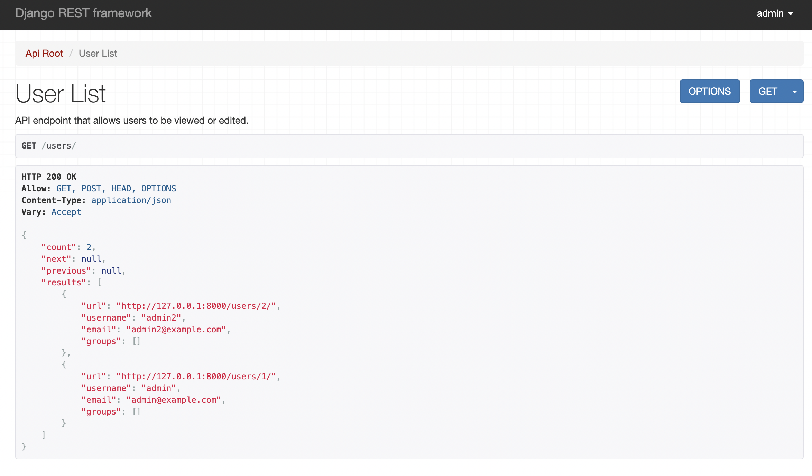

# Django practice 
실행하는 방법

```bash
python3 -m venv env
source env/bin/activate

pip install django
pip install djangorestframework

python manage.py migrate
python manage.py runserver
```

browser에서 `http://127.0.0.1:8000/users/` 입력 하면 아래와 같은 이미지를 볼 수 있음



## References 
[django doc kr](https://docs.djangoproject.com/ko/3.2/intro/overview) \
[django-rest-framewwork](https://www.django-rest-framework.org/tutorial/quickstart/#testing-our-api)
